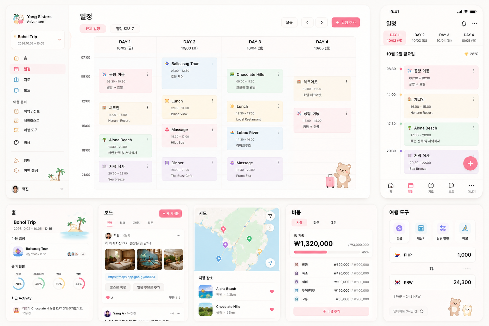

# Yang Sisters Adventure UI concept

이 이미지는 제품 UI의 **북극성 참고자료**다. 특정 화면을 픽셀 단위로 복제하는 명세가 아니며, 실제 데이터·접근성·반응형 사용성과 각 GitHub 이슈의 완료 조건이 우선한다.

## 핵심 방향

- 여행 일정, 장소, 사람, 날짜가 장식보다 먼저 보인다.
- 따뜻한 off-white 배경과 coral 계열 primary accent를 사용한다.
- 일정 카테고리는 낮은 채도의 pastel surface로 구분한다.
- 강한 그림자, glassmorphism, 과도한 gradient와 둥근 카드를 피한다.
- Desktop은 여러 날짜를 동시에 비교하는 itinerary workspace로 만든다.
- Mobile은 desktop을 축소하지 않고 날짜 tab과 timeline에 집중한다.
- 사진은 장소와 공유 자료를 이해하는 데 필요한 위치에만 사용한다.
- 귀여운 여행 illustration은 빈 공간이나 브랜드 포인트로 제한한다.

## 화면별 참고 포인트

### 일정

- Desktop: 시간축과 DAY column을 함께 보여주는 multi-day view
- Mobile: horizontal DAY tabs, 세로 timeline, 빠른 추가 버튼
- 일정 카테고리는 색만으로 구분하지 않고 icon/label을 함께 사용
- 후보와 확정 일정은 동일 화면에서 빠르게 전환 가능해야 함

### Navigation

- Desktop: Trip switcher가 있는 좌측 navigation
- Mobile: 홈, 일정, 지도, 보드, 더보기의 5개 bottom navigation
- 비용, 예약, 체크리스트, 도구, 멤버, 설정은 더보기로 이동

### 홈·보드·지도·비용·도구

- 홈은 다음 일정, 준비 현황, Activity를 짧게 요약
- 보드는 사람과 공유 콘텐츠가 중심인 feed
- 지도는 map과 저장 장소 list를 함께 제공
- 비용은 총액보다 예산 대비 사용 흐름과 정산 action을 명확히 표시
- 여행 도구는 한 화면에 한 가지 작업을 빠르게 수행하도록 구성

## 구현 원칙

- `Bohol`, 특정 날짜, 특정 멤버와 통화는 UI에 하드코딩하지 않는다.
- WCAG AA 수준의 text contrast와 keyboard focus를 유지한다.
- 색상만으로 상태나 카테고리를 전달하지 않는다.
- 320px 이상 mobile, 일반 tablet, desktop에서 주요 흐름을 검증한다.
- 반복되는 색상, spacing, radius, typography는 design token으로 관리한다.

## 관련 이슈

- [#3 프런트엔드 기능 분리와 협업 중심 Navigation 개편](https://github.com/higwon/yang-sisters-adventure/issues/3)
- [#4 Desktop 전체 itinerary와 Mobile 일정 UX 완성](https://github.com/higwon/yang-sisters-adventure/issues/4)
- [#7 ActivityLog와 협업형 Home 재설계](https://github.com/higwon/yang-sisters-adventure/issues/7)
- [#8 OpenStreetMap 기반 지도와 Place 경험 개선](https://github.com/higwon/yang-sisters-adventure/issues/8)
- [#12 Collaborative Travel Workspace MVP Epic](https://github.com/higwon/yang-sisters-adventure/issues/12)
